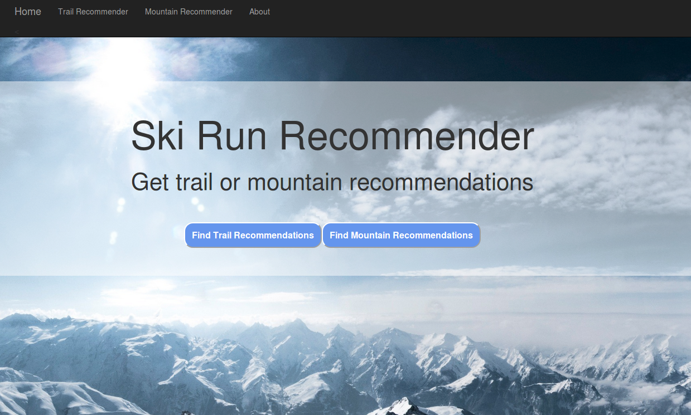
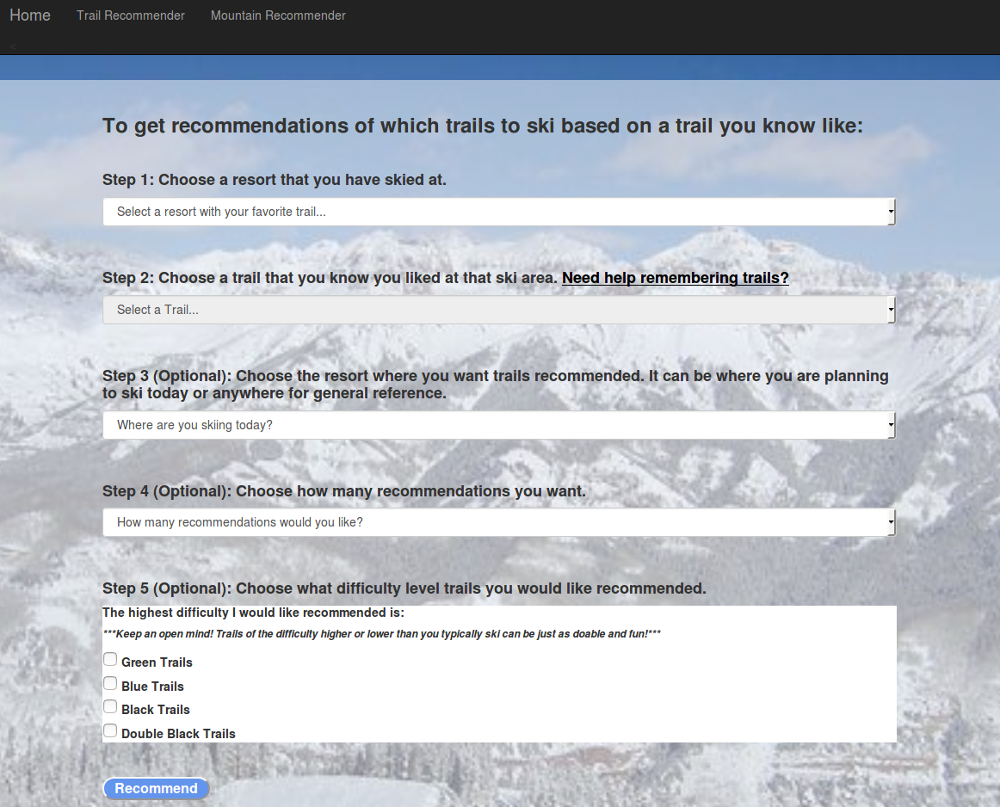
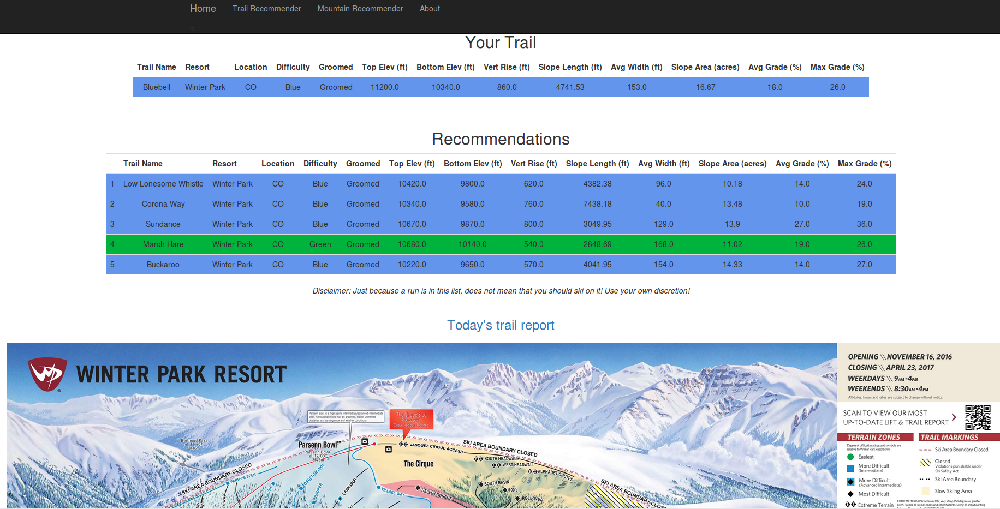
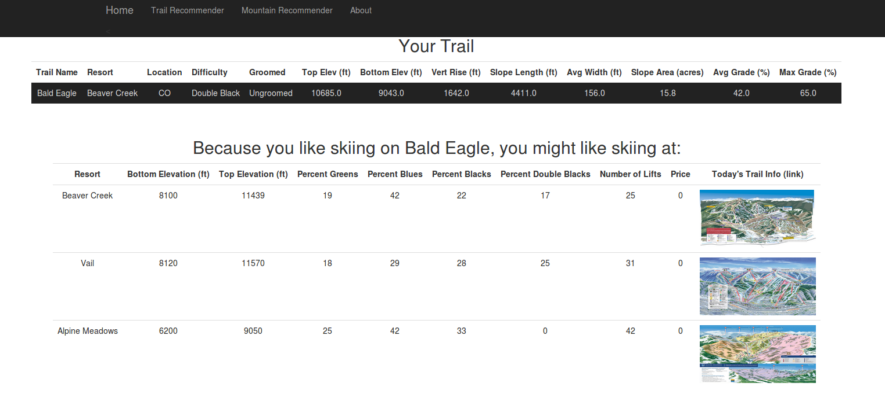
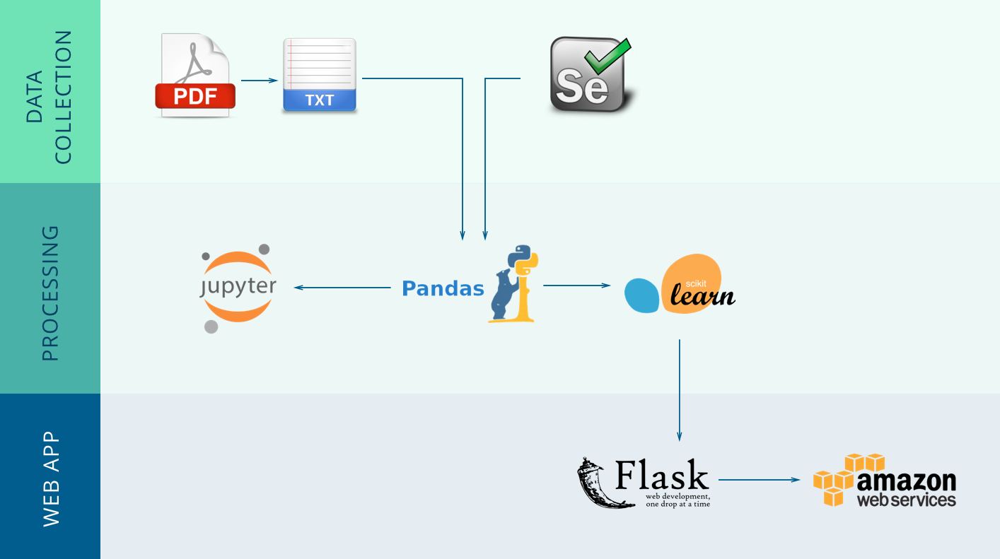

# Ski Run Recommender

Karen Farbman

Galvanize Data Science Immersive - October 2017

[SkiRunRecommender.com](skirunrecommender.com)

## Table of Contents
1. [Background](#background)
2. [Web Application](#web-application)
3. [Data Collection and Cleaning](#data-collection-and-cleaning)
4. [Technologies Used](#technologies-used)
5. [Recommender System](#recommender-system)
6. [Future Steps](#future-steps)
7. [Repo Structure](#repo-structure)

## Background

As I was prepping for my Professional Ski Instructors of America (PSIA) Level 3 exam at Vail (never having skied at Vail), word on the slopes was that the mogul portion of the ski exam was going to be on Prima and Pronto. From my research on Vail, I knew that Prima and Pronto were black and double black, but I didn't know what to compare them to. With Winter Park as my home mountain, I had skied a huge range of black mogul runs, and they were all vastly different. Someone told me that if I could ski Outhouse at Winter Park, that was a pretty good indicator of how I would do on Prima or Pronto - they had a similar slope and width and were ungroomed. 

How awesome would it be to find runs similar to a given run based on their features, even at a mountain you know nothing about? You can find runs at a mountain you're unfamiliar with that are similar to a run you love. Or you can find out what a run you've never skied on is like by finding out which runs it is like at a resort you know.

## Web Application 

[SkiRunRecommender.com](skirunrecommender.com)



From the homepage, you can choose if you want a specific trail recommendation, or if you want a recommendation on which mountain to ski.

Then, you can select a trail that you like from a resort that you know. You have the option to select which resort you would like recommendations at (for the trail recommender), which difficulty trails you would like included (also for the trail recommender) and how many recommendations you would like.



This will bring up a page with the original trail, as well as the recommendations and their stats, trail maps, and links to the resorts' trail report for that day.

Trail Recommendations:


Mountain Recommendations:


Created using Flask and self-hosted on AWS.

## Data Collection and Cleaning

I began by downloading pdfs of the Master Development plans from various mountains. I converted a table of information on the current runs from the pdfs into text files and parsed the text files into tables to put in pandas DataFrames. I needed to pay special attention to the differences in the tables from the different resorts. I found archived grooming reports for each resort to add as another feature. Since the Master Development Plans classify the runs differently than trail maps, I also webscraped Jollyturns.com to get the trails by colors. Since the Master Developments plans didn't necessarily have the same trails that were on the grooming reports and Jollyturns, I had to reconcile which trails I was using (and account for differences in spelling).

I ended up with 1125 runs from 12 different resorts. The features used for trail recommendations include Trail Top Elevation, Trail Bottom Elevation, Vertical Drop, Slope Length, Slope Average Width, Slope Area, Average Grade, Max Grade, and Groomed. The features used for mountain recommendations include all the features for trail recommendations plus Resort Top Elevation, Resort Bottom Elevation, Percent Green, Blue, Black, and Double Black trails, Number of Lifts, and Price.

## Technologies Used

BeautifulSoup, selenium, pandas, numpy, sklearn, matplotlib, flask, html/javascript/css, AWS



## Recommender System

This recommender takes into account information about the runs. It looks at a run and calculates how similar it is to every other run. The runs are sorted from most similar to least similar and then filtered by resort or difficulty level if desired. So why is this useful for this project? Because you can start with a run you know you like, and it can give you back the ones that are most similar to it.

The similarity metric used is the cosine similarity. For the trail recommendations, the similarity is calculated between the chosen run and all other runs. For the mountain recommendations, the average of the similarities between the chosen run and all of the runs at each mountain is calculated, and the resorts are sorted by highest average similarity.

## Future Steps

In the future, I'd like to add more trails from more resorts. Ideally, I'd also like to add information on aspect to indicate snow conditions. A potential addition would be daily grooming information instead of static. 

## Repo structure
```
├── data (contains txt/csv files from Master Development Plan pdfs and pickles)
|     ├── df.pkl (pickle of dataframe used for trail recommendations from comb_tables.py)
|     ├── mtn_df.pkl (pickle of dataframe used for mountain recommendations from make_mtn_df.py)
|     └── resort_dict.pkl (pickle of dictionary of resort/color dataframes from webscrape_trails.py)
├── notebooks (contains scripts used for testing and visualizations)
|     ├── clustering.ipynb (visualizations of clustering methods)
|     ├── supervised_learning.ipynb (a look into classification models of runs)
|     └── visualizations.ipynb (interesting visualizations)
├── src
|     ├── create_tables (contains scripts which take in pdf/txt/csv and convert to a dataframe by resort; slightly different conditions from tables meant using different scripts)
|     ├── comb_tables.py
|     |       -creates a dictionary of resort dataframes (created from scripts in create_tables)
|     |       -fixes trail names
|     |       -adds grooming column
|     |       -adds color column (from webscrape_trails and manually)
|     |       -removes trails that don't have grooming or color info (were in the master development plan)
|     |       -puts the dataframes from each resort back together
|     |       -maps ability levels and colors to numbers
|     |       -fixes names from Monarch and trails that have the same name at the same resort
|     |       -saves a pickle of the dataframe
|     ├── cosine_sims.py (made cosine_sim_recommendations function (actually appears in app.py))
|     ├── make_mtn_df.py (creates dataframe from pickle of dataframe used for recommendations, webscrapes to add resort level data, saves a pickle of the new dataframe)
|     ├── resort_stats.py (webscrapes stats by resort, NOT CURRENTLY USING)
|     └── webscrape_trails.py (webscrapes to get trails by color for each resort, saves a pickle of dictionary of results)
├── web_app
|     ├── static
|     ├── templates
|     └── app.py (runs web app)
└── README.md
```
